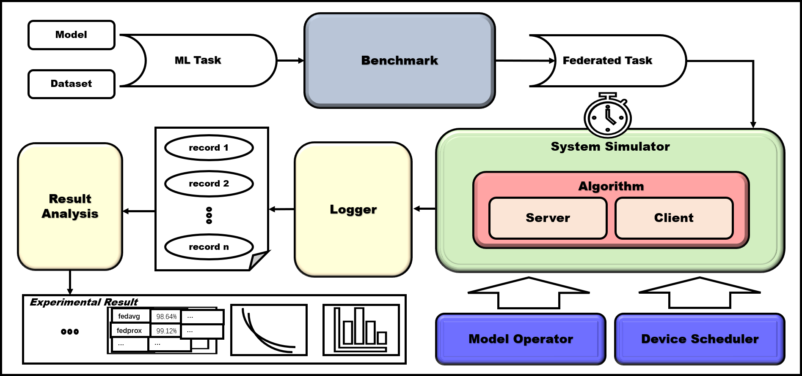

# FLGo Framework


The whole workflow of FLGo is as shown in the above picture. FLGo framework mainly runs 
by three steps. 

Firstly, given a ML task (i.e. dataset and model), FLGo converts it into a static federated 
task through partitioning the original ML dataset into subsets of data owned by different 
clients, and hide the task-specific details to the algorithms. 

Secondly, different federated algorithms can run on the fed static federated task to train 
a particular model (e.g. CNN, MLP) . During training phase, the system simulator will create 
a simulated environment where a virtual global clock can fairly measure the time and arbitrary 
client behaviors can be modeled, which is also transparent to the implementation of algorithms. 

Finally, the experimental tracker in FLGo is responsible for tracing the running-time information 
and organizing the results into tables or figures.

The organization of all the modules is as below

```
├─ algorithm
│  ├─ fedavg.py                   //fedavg algorithm
│  ├─ ...
│  ├─ fedasync.py                 //the base class for asynchronous federated algorithms
│  └─ fedbase.py                  //the base class for federated algorithms
|
├─ benchmark
│  ├─ mnist_classification			//classification on mnist dataset
│  │  ├─ model                   //the corresponding model
│  |  └─ core.py                 //the core supporting for the dataset, and each contains three necessary classes(e.g. TaskGen, TaskReader, TaskCalculator)							
│  ├─ base.py                 // the base class for all fedtask
│  ├─ ...
│  ├─ RAW_DATA                   // storing the downloaded raw dataset
│  └─ toolkits						//the basic tools for generating federated dataset
│     ├─ cv                      // common federal division on cv
│     │  ├─ horizontal           // horizontal fedtask
│     │  │  └─ image_classification.py   // the base class for image classification
│     │  └─ ...
│     ├─ ...
│     ├─ partition.py            // the parttion class for federal division
│     └─ visualization.py        // visualization after the data set is divided
|
├─ experiment
│  ├─ logger                            //the class that records the experimental process
│  │  ├─ ...
│  |  └─ simple_logger.py				//a simple logger class
│  ├─ analyzer.py                  //the class for analyzing and printing experimental results
|  └─ device_scheduler.py                    // automatically schedule GPUs to run in parallel
|
├─ simulator                     //system heterogeneity simulation module
│  ├─ base.py							//the base class for simulate system heterogeneity
│  ├─ default_simulator.py				//the default class for simulate system heterogeneity
|  └─ ...
|
├─ utils
│  ├─ fflow.py							//option to read, initialize,...
│  └─ fmodule.py						//model-level operators
└─ requirements.txt 
```
