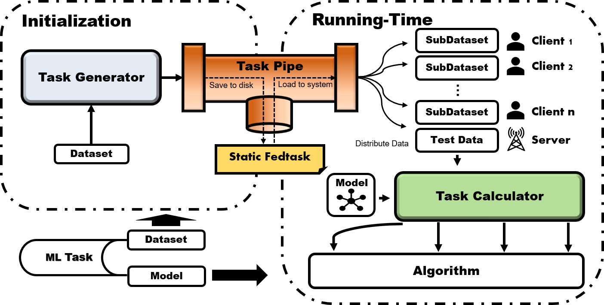

# Benchmark

At the initialization phase, the original dataset is input to `TaskGenerator` that 
accordingly and flexibly partitions the dataset into local sub-datasets owned by 
clients and a testing dataset owned the server. And the local data is further divided 
to training part and validation part for hyper-parameter tuning purpose. Then, all of 
the division information on the original dataset will be stored by `TaskPipe` into 
the disk as a static `fedtask`, where different federated algorithms can fairly 
compare with each other on the same fedtask with a particular model. 

During the running-time phase,  `TaskPipe` first distributes the partitioned datasets 
to clients and the server after loading the saved partition information and the original 
dataset into memory. After the model training starts, Algorithm module can either use the 
presetting `TaskCalculator` APIs to complement the task-specific calculations (i.e. loss 
computation, transferring data across devices, evaluation, batching data) or optimize in 
customized way. In this manner, the task-relevant details will be blinded to the algorithm 
for most cases, which significantly eases the development of new algorithms. 